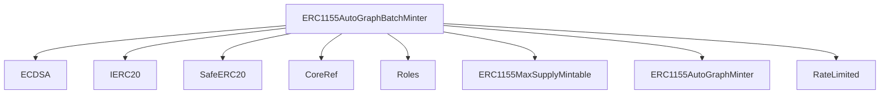
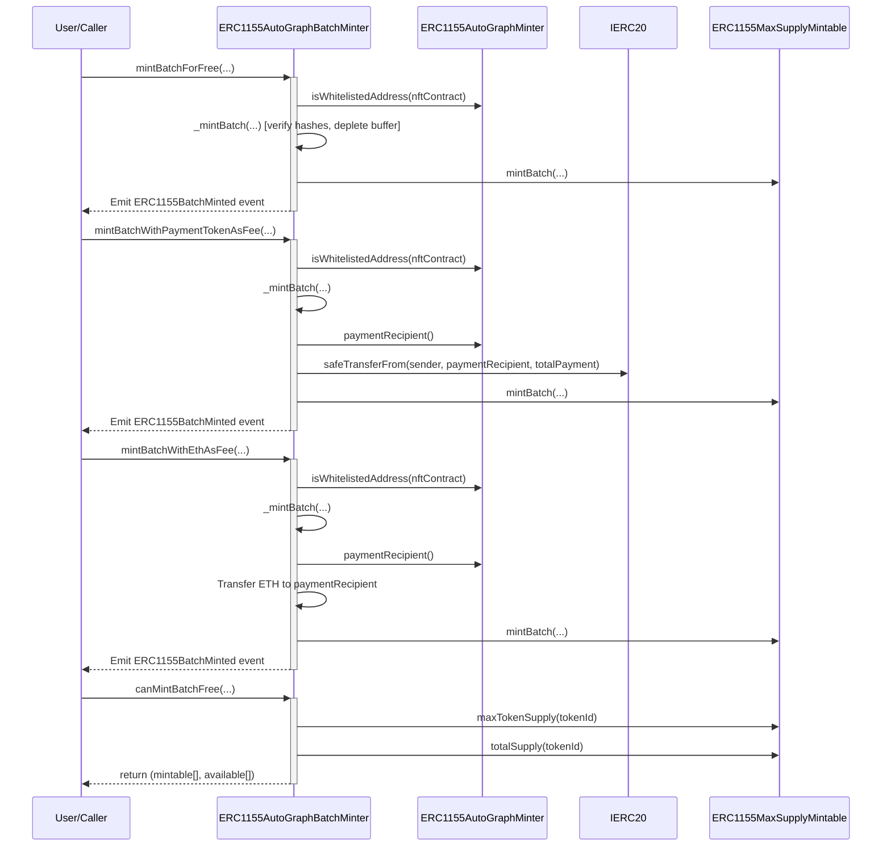

# ERC1155AutoGraphBatchMinter.sol

## Introduction
Batch minting extension for [ERC1155AutoGraphMinter](./ERC1155AutoGraphMinter.md). Deployed as a separate contract to keep bytecode within block gas limits on zkSync OS.

### Overview
The batch minter reads whitelist, payment recipient, and expiry config from the primary `ERC1155AutoGraphMinter` via cross-contract view calls. It maintains its own `completedJobs` mapping and rate limit buffer.

#### Top-down

#### Sequence

## Base Contracts
### OpenZeppelin
- [ECDSA](https://github.com/OpenZeppelin/openzeppelin-contracts/blob/master/contracts/utils/cryptography/ECDSA.sol): Elliptic Curve Digital Signature Algorithm for signature verification.
- [SafeERC20](https://github.com/OpenZeppelin/openzeppelin-contracts/blob/master/contracts/token/ERC20/utils/SafeERC20.sol): Safe wrappers for ERC20 transfer and approve.
- [IERC20](https://github.com/OpenZeppelin/openzeppelin-contracts/blob/master/contracts/token/ERC20/IERC20.sol): Interface for the ERC20 standard.
### Protocol Specific
- [CoreRef](../refs/CoreRef.md): Provides a reference to the protocol's core contract.
- [Roles](../core/Roles.md): Manages different roles for access control.
- [ERC1155MaxSupplyMintable](./ERC1155MaxSupplyMintable.md): ERC-1155 with max supply minting.
- [ERC1155AutoGraphMinter](./ERC1155AutoGraphMinter.md): Primary minter, provides config via view functions.
- [RateLimited](../utils/extensions/RateLimited.md): Rate-limiting functionality.

## Features
- Batch minting of ERC-1155 tokens (free, ERC20 fee, or ETH fee).
- Reads whitelist and payment config from the primary `ERC1155AutoGraphMinter`.
- Independent `completedJobs` tracking and rate limit buffer.
- `canMintBatchFree` view function for supply and job pre-checks.

## Required Roles
- `MINTER_PROTOCOL_ROLE`: Required on Core to mint via `ERC1155MaxSupplyMintable`.
- `LOCKER_PROTOCOL_ROLE`: Required on Core for the global reentrancy lock.

## Events
### `ERC1155BatchMinted`
Emitted when a batch of ERC1155 tokens are minted.
Logs:
- `nftContract`: The address of the NFT contract.
- `recipient`: The address of the recipient.
- `tokenIds`: The IDs of the tokens minted.
- `units`: The number of tokens minted per token ID.

## Constructor
Accepts four arguments:
- `_core`: The address of the core contract.
- `_autoGraphMinter`: Reference to the primary `ERC1155AutoGraphMinter` for config lookups.
- `_replenishRatePerSecond`: Rate limit buffer replenish rate.
- `_bufferCap`: Maximum rate limit buffer capacity.

## Functions
### `mintBatchForFree`
Mints a batch of NFTs for free. Verifies whitelist, hashes, signatures, and expiry for each item.

### `mintBatchWithPaymentTokenAsFee`
Mints a batch of NFTs with an ERC20 token as fee. Aggregates total payment and transfers to the primary minter's `paymentRecipient`.

### `mintBatchWithEthAsFee`
Mints a batch of NFTs with ETH as fee. Verifies `msg.value` matches total payment and transfers to the primary minter's `paymentRecipient`.

### `canMintBatchFree`
View function that checks which items in a batch can be minted. Combines supply checks (maxSupply vs totalSupply) with completed job checks. Accounts for prior demand from duplicate tokenIds within the same batch.

### `getHash`
Computes the hash of a message based on `HashInputsParams` (same encoding as primary minter).

### `recoverSigner`
Recovers the address that signed a given message hash.
